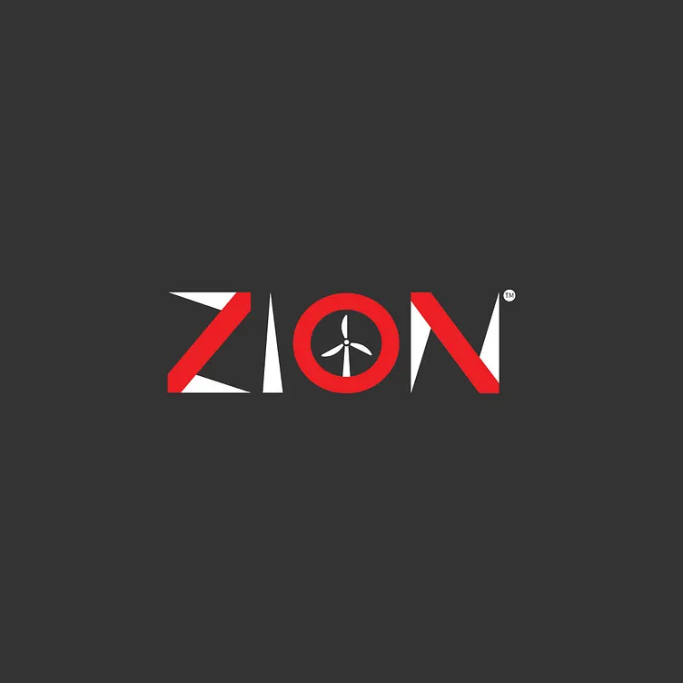

# ZION — Church Website & Prayer Camp Booking System

<p align="center">
  
</p>

<p align="center">
  A modern church website and prayer camp booking platform built with Next.js.
</p>

<p align="center">
  <a href="#overview">Overview</a> •
  <a href="#features">Features</a> •
  <a href="#technology-stack">Technology</a> •
  <a href="#architecture">Architecture</a> •
  <a href="#getting-started">Getting Started</a> •
  <a href="#documentation">Documentation</a> •
  <a href="#roadmap">Roadmap</a>
</p>

---

## Overview

**Zion** is a modern church website and prayer camp booking system designed to give a church a strong digital presence while providing members and visitors with a simple way to discover the church, explore its activities, register for prayer camps, and manage their bookings.

The project combines a public-facing church website with authenticated user functionality and an administrative dashboard.

The first version focuses on establishing the core platform and architecture while intentionally leaving more advanced booking, content management, SEO, performance optimization, and PWA capabilities for subsequent iterations.

> **Zion is a v1 foundation — not the final system.**
>
> The goal of this release was to build a working, maintainable foundation that can be expanded without having to rewrite the entire application.

---

# Features

## Public Website

Visitors can explore the church through:

- Home page
- About the church
- Church history
- Vision and mission
- Core values
- Lead pastor information
- Weekly services
- Ministries
- Events
- Sermons
- Gallery
- Contact information
- Prayer camp information

The public website is designed to be responsive and optimized for a modern, youth-focused church experience.

---

## Authentication

Zion includes authentication for registered users.

Authenticated users can:

- Create an account
- Sign in
- Access their profile
- View account information
- Access protected areas of the application
- Manage information associated with their account

Authentication is handled through the application's server-side authentication layer rather than relying solely on client-side state.

---

## User Dashboard

Registered users have access to a protected user area where they can:

- View their profile
- View their account information
- Access prayer camp booking information
- Track booking status

The dashboard provides the foundation for future functionality such as:

- Booking confirmations
- Profile editing
- Downloadable confirmations
- Booking history
- Notifications

---

## Prayer Camp Booking

The first version includes the foundation for online prayer camp registration.

The booking flow is intentionally minimal in v1 because the initial goal was to establish the application architecture before implementing the more complex camp-management rules.

The planned booking model supports information such as:

- Full name
- Phone number
- Email
- Gender
- Date of birth
- Emergency contact
- Arrival date
- Departure date
- Prayer request
- Additional notes
- Booking status

Future versions will introduce more sophisticated camp availability and capacity logic.

---

## Admin Dashboard

Administrators have access to a protected administration area.

The dashboard provides the foundation for:

- Managing users
- Managing prayer camps
- Managing bookings
- Reviewing registrations
- Approving bookings
- Declining bookings
- Editing booking information
- Managing website content

The administrative architecture is intentionally separated from the public-facing application.

---

## Content Management

Zion includes a content-management foundation for dynamic website content.

The goal is to prevent the entire website from depending on hardcoded text.

Content that can be managed or expanded through the CMS architecture includes areas such as:

- Homepage content
- About information
- Services
- Church information
- Contact information
- Other site-wide content

Some frontend sections, including the current upcoming-event banner, are **not yet fully CMS-driven** and remain on the v1 improvement roadmap.

---

# Technology Stack

## Frontend

- **Next.js**
- **React**
- **JavaScript**
- **Vanilla CSS / CSS Modules**

## Backend

- **Next.js Server Actions**
- **Prisma ORM**
- **PostgreSQL**

## Application

- Authentication
- Role-based access
- Protected routes
- Server-side data operations
- Progressive Web App foundation

---

# Why These Technologies?

## Why Next.js?

Next.js provides the foundation for the entire application.

It allows Zion to combine:

- React components
- Server Components
- Client Components
- Server Actions
- Routing
- Metadata
- Static rendering
- Dynamic rendering
- API/server functionality

Rather than maintaining a completely separate frontend and backend application, Zion can keep much of the application logic within one Next.js project.

This keeps the architecture relatively simple for the first version.

---

## Why JavaScript instead of TypeScript?

The original project requirements suggested TypeScript.

However, the project was intentionally implemented in JavaScript.

The reason was practical.

At the time of development, TypeScript was not yet a technology I was comfortable with. Introducing a strict type system while simultaneously learning the framework, authentication, Prisma, database design, Server Actions, and application architecture would have added another layer of complexity.

For v1, the priority was:

```text
Understand the architecture
        ↓
Build the system
        ↓
Solve real problems
        ↓
Ship
        ↓
Improve
